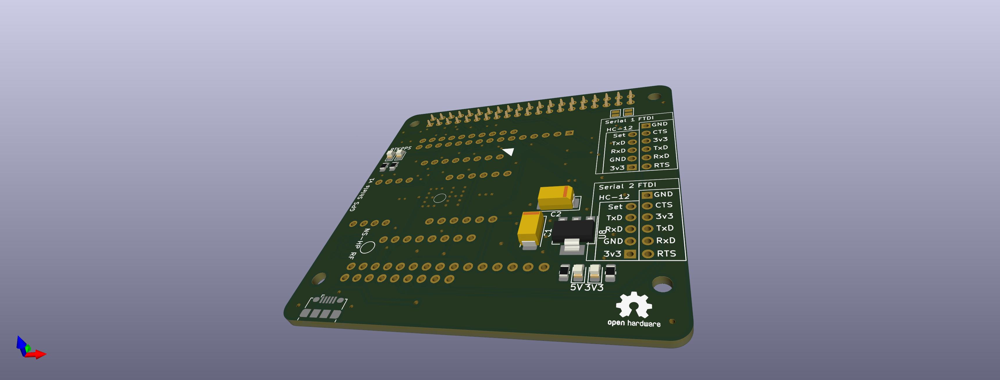

# GNSS Shield
 - Should fit a Raspberry Pi 40 pin header or compatible.
 - Has footprints for Adafruits zedf9p, Navspark Mini, Navspark NS-HP, and Mikroe gnss-rtk-click
 - Has FTDI and HC-12 connectors for both UART1 and UART2 on the GNSS Modules
 - Connectes UART2 to Raspberry Pi 4 UART2

